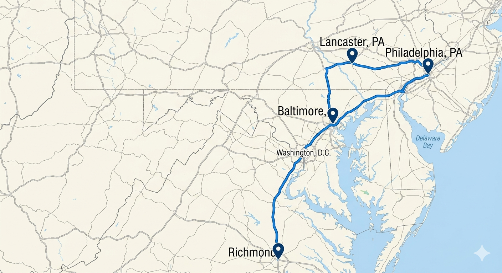
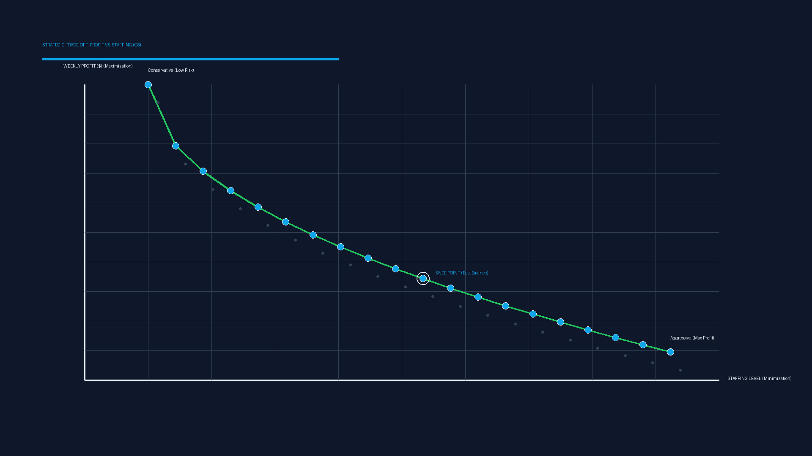

# DSS USA Stores: Forecasting & Multi-Objective Optimization
## Decision Support System (DSS) Project Presentation

---

## 1. Contexto e Objetivos Estratégicos

O projeto **DSS USA Stores** surge da necessidade de modernizar a gestão operacional de uma rede de retalho composta por quatro unidades geográficas distintas: **Baltimore, Lancaster, Philadelphia e Richmond**.

### Desafios de Negócio:
*   **Volatilidade da Procura:** Flutuações diárias baseadas em *Num_Customers* (alvo) e variáveis exógenas (*TouristEvent*, *Date*).
*   **Gestão de Recursos Humanos:** Diferenciação entre staff **Junior (J)** e **Expert (X)**.
*   **Gargalos Logísticos:** Restrição física de **10.000 unidades vendidas** por semana para toda a rede (Objetivo O2).

---

## 2. Abordagem Metodológica Detalhada

### A. Lógica de Previsão (Forecasting)
O pipeline compara modelos univariados e multivariados contra a baseline **Seasonal Naive** (repetição da semana anterior).
*   **Modelos Testados:** VAR, ARIMAX e Machine Learning Multivariado.
*   **Métricas de Qualidade:** NMAE, RMSE, R² e MAE.
*   **Validação:** Estratégias de *Rolling Window* e *Growing Window* com >10 iterações para garantir robustez.

### B. Modelação Matemática (Profit Logic)
A base do DSS é o motor de cálculo que traduz recursos em lucro, conforme definido no guia técnico:

1.  **Capacidade de Atendimento ($A_{s,d}$):**
    $$A_{s,d} = \min(7 \cdot X_{s,d} + 6 \cdot J_{s,d}; C_{s,d})$$
    *Onde $C_{s,d}$ é a previsão de clientes.*

2.  **Unidades Vendidas por Cliente ($U_{s,d,c}$):**
    $$U_{s,d,c} = \text{round}\left(\frac{F \cdot 10}{\ln(2 - PR_{s,d})}\right)$$
    *F é o fator de ajuda da loja ($F_J$ ou $F_X$).*

3.  **Lucro da Unidade Vendida ($P_{s,d,c}$):**
    $$P_{s,d,c} = \text{round}(U_{s,d,c} \cdot (1 - PR_{s,d}) \cdot 1.07)$$

4.  **Lucro Semanal ($R_s$):**
    $$R_s = \sum_{d=1}^{7} (R_{s,d}) - W_s$$
    *$W_s$ representa os custos fixos semanais da loja.*

---

## 3. Especificações Técnicas por Loja

| Loja | $F_J$ | $F_X$ | $W_s$ (Custo Fixo) |
| :--- | :--- | :--- | :--- |
| **Baltimore** | 1.00 | 1.15 | $700 |
| **Lancaster** | 1.05 | 1.20 | $730 |
| **Philadelphia** | 1.10 | 1.15 | $760 |
| **Richmond** | 1.15 | 1.25 | $800 |

*   **Custos de RH:** 
    *   Junior: $60 (dia útil) / $70 (fim de semana). Capacidade: 6 clientes.
    *   Expert: $80 (dia útil) / $95 (fim de semana). Capacidade: 7 clientes.

---

## 4. Experiências Computacionais: Otimização

O espaço de busca compreende um vetor numérico de **84 parâmetros** (4 lojas $\times$ 7 dias $\times$ 3 variáveis: $J, X, PR$).

### Algoritmos e Métodos:
*   **Busca:** Hill Climbing, Simulated Annealing (SANN) e Algoritmos Genéticos.
*   **Análise de Convergência:** Monitorização da qualidade das iterações para evitar estagnação precoce.
*   **O1 (Local):** Maximização de lucro individual.
*   **O2 (Rede):** Maximização global com **Hard Constraint** de 10.000 unidades via **Death Penalty**.
*   **O3 (Multi):** Maximização de lucro vs. Minimização de staff via **Fronteira de Pareto**.

---

## 5. Demonstração do Sistema (DSS)

O sistema consolidado permite:
1.  **Seleção da Semana:** O utilizador escolhe a semana alvo para planeamento.
2.  **Visualização de Previsões:** Exibição de valores previstos e reais (quando disponíveis).
3.  **Plano Otimizado:** Relatório detalhado por dia contendo o número de clientes, unidades vendidas, vendas, custos e lucro total.

---

## 6. Conclusões

O projeto **DSS USA Stores** demonstra que a aplicação de métodos inteligentes de análise de dados resulta em:
1.  **Precisão Preditiva:** Redução significativa do erro em comparação com métodos ingénuos (*Seasonal Naive*).
2.  **Otimização de Lucro:** Identificação de combinações ideais de desconto e staff que seriam impossíveis de encontrar manualmente.
3.  **Suporte à Decisão:** Uma interface clara que permite aos gestores escolher entre diferentes perfis estratégicos na Fronteira de Pareto.

---
**Projeto:** DSS USA Stores | **Data:** Maio 2026 | **Status:** Concluído para Apresentação
